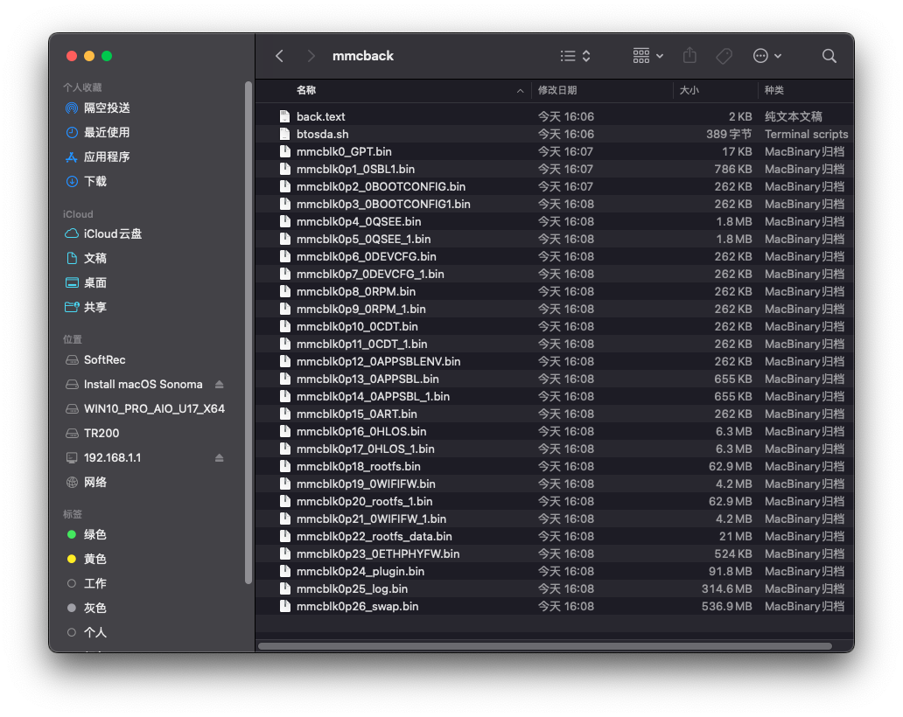

# 源自亚瑟备份方案
> 我的方案是将他备份到移动硬盘上，所在分区挂在点为 /mnt/sda2 ，备份之需要2gb的空间

```shell
dd if=/dev/mmcblk0 bs=512 count=34 of=/mnt/sda2/mmcback/mmcblk0_GPT.bin conv=fsync
dd if=/dev/mmcblk0p1 of=/mnt/sda2/mmcback/mmcblk0p1_0SBL1.bin conv=fsync
dd if=/dev/mmcblk0p2 of=/mnt/sda2/mmcback/mmcblk0p2_0BOOTCONFIG.bin conv=fsync
dd if=/dev/mmcblk0p3 of=/mnt/sda2/mmcback/mmcblk0p3_0BOOTCONFIG1.bin conv=fsync
dd if=/dev/mmcblk0p4 of=/mnt/sda2/mmcback/mmcblk0p4_0QSEE.bin conv=fsync
dd if=/dev/mmcblk0p5 of=/mnt/sda2/mmcback/mmcblk0p5_0QSEE_1.bin conv=fsync
dd if=/dev/mmcblk0p6 of=/mnt/sda2/mmcback/mmcblk0p6_0DEVCFG.bin conv=fsync
dd if=/dev/mmcblk0p7 of=/mnt/sda2/mmcback/mmcblk0p7_0DEVCFG_1.bin conv=fsync
dd if=/dev/mmcblk0p8 of=/mnt/sda2/mmcback/mmcblk0p8_0RPM.bin conv=fsync
dd if=/dev/mmcblk0p9 of=/mnt/sda2/mmcback/mmcblk0p9_0RPM_1.bin conv=fsync
dd if=/dev/mmcblk0p10 of=/mnt/sda2/mmcback/mmcblk0p10_0CDT.bin conv=fsync
dd if=/dev/mmcblk0p11 of=/mnt/sda2/mmcback/mmcblk0p11_0CDT_1.bin conv=fsync
dd if=/dev/mmcblk0p12 of=/mnt/sda2/mmcback/mmcblk0p12_0APPSBLENV.bin conv=fsync
dd if=/dev/mmcblk0p13 of=/mnt/sda2/mmcback/mmcblk0p13_0APPSBL.bin conv=fsync
dd if=/dev/mmcblk0p14 of=/mnt/sda2/mmcback/mmcblk0p14_0APPSBL_1.bin conv=fsync
dd if=/dev/mmcblk0p15 of=/mnt/sda2/mmcback/mmcblk0p15_0ART.bin conv=fsync
dd if=/dev/mmcblk0p16 of=/mnt/sda2/mmcback/mmcblk0p16_0HLOS.bin conv=fsync
dd if=/dev/mmcblk0p17 of=/mnt/sda2/mmcback/mmcblk0p17_0HLOS_1.bin conv=fsync
dd if=/dev/mmcblk0p18 of=/mnt/sda2/mmcback/mmcblk0p18_rootfs.bin conv=fsync
dd if=/dev/mmcblk0p19 of=/mnt/sda2/mmcback/mmcblk0p19_0WIFIFW.bin conv=fsync
dd if=/dev/mmcblk0p20 of=/mnt/sda2/mmcback/mmcblk0p20_rootfs_1.bin conv=fsync
dd if=/dev/mmcblk0p21 of=/mnt/sda2/mmcback/mmcblk0p21_0WIFIFW_1.bin conv=fsync
dd if=/dev/mmcblk0p22 of=/mnt/sda2/mmcback/mmcblk0p22_rootfs_data.bin conv=fsync
dd if=/dev/mmcblk0p23 of=/mnt/sda2/mmcback/mmcblk0p23_0ETHPHYFW.bin conv=fsync
dd if=/dev/mmcblk0p24 of=/mnt/sda2/mmcback/mmcblk0p24_plugin.bin conv=fsync
dd if=/dev/mmcblk0p25 of=/mnt/sda2/mmcback/mmcblk0p25_log.bin conv=fsync
dd if=/dev/mmcblk0p26 of=/mnt/sda2/mmcback/mmcblk0p26_swap.bin conv=fsync
```
> 然后一条一条执行上述命令就会在移动硬盘的第二分区下的mmcback下产生备份文件。

# 快捷命令
> 也可以使用目录中提供的back.text 和 btosda.sh 文件进行快速备份。但是前提是你需要将back.text文件中存放位置，替换成你自己的地址。并将这两个文件复制到路由器中。下面展示了操作指令和执行结果。

```shell
root@iStoreOS:/mnt/sda2/mmcback# chmod +x ./btosda.sh
root@iStoreOS:/mnt/sda2/mmcback# ./btosda.sh ./back.text
```

# 执行结果
> 看图脚本自动执行了所有备份分区，不包含0p27分区
> 

## 参考
- https://github.com/lgs2007m/Actions-OpenWrt/blob/main/%E5%88%B7%E6%9C%BA%E6%95%99%E7%A8%8B/%E4%BA%AC%E4%B8%9C%E4%BA%91AX1800-Pro%E4%BA%9A%E7%91%9F_AX6600%E9%9B%85%E5%85%B8%E5%A8%9C%E5%88%86%E5%8C%BA%E5%A4%87%E4%BB%BD+TTL%E5%8F%8C%E5%88%86%E5%8C%BA%E5%88%B7%E6%9C%BA+%E5%9B%9E%E5%8E%9F%E5%8E%82+USB%E6%95%91%E7%A0%96%E6%95%99%E7%A8%8B20240510.md
- https://www.yindan.me/tutorial/jdc-ax1800-pro.html