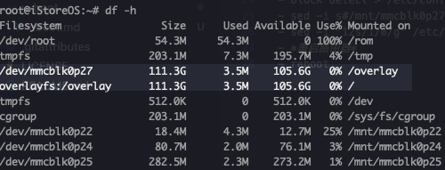

## 扩容 overlay
> 没有经过gpt扩容的Ax1800pro 可以安装固件的分区非常小。安装完openwrt 或者 iStoreOS 后基本上只剩下2～4mb的空间，很难安装下大的软件，但是好在可以扩容，我的128gb 版本有0p27号分区有119gb空间，可以将他修改为 overlay，这样就可以安装大的软件。扩容overlay仅仅适合没有采用gpt扩容的ax1800pro，扩容过的ax1800pro就无需这部分操作。没有必要了。

## 扩容 overlay 缺点
- 任然无法通过ubbot刷写大容量固件。
- 系统恢复、安装固件后，这个步骤需要重新再做一遍。

## 扩容 overlay 优点
- 可以随时在刷回京东自己的固件。
- 基本不会变砖，不会使用的到ttl专用设备。虽然他很便宜。
- 适合仅仅需要互联网的用户

## 扩容步骤 
- ssh 链接路由器 `ssh -oHostKeyAlgorithms=+ssh-rsa -l root 192.168.1.1`
- *格式化 mmcblk0p27 大分区*
- umount /dev/mmcblk0p27
- mkfs.ext4 -F /dev/mmcblk0p27
- *复制当前 overlay 文件到 mmcblk0p27*
- mkdir -p /mnt/mmcblk0p27
- mount /dev/mmcblk0p27 /mnt/mmcblk0p27
- cp -r /overlay/* /mnt/mmcblk0p27
- ls /mnt/mmcblk0p27
- *修改分区*
- block detect > /etc/config/fstab
- sed -i s#/mnt/mmcblk0p27#/overlay# /etc/config/fstab
- sed -i '12s/1/0/g' /etc/config/fstab
- *重启路由器*
- reboot

> 扩容之后通过ssh链接路由器后，通过指令df- h 应该可以看到这样结构
> 