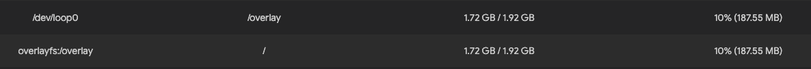

## 如何扩容
> 扩容需要对应的u-boot文件，及扩容gpt分区表。这位大神提供了详细的方法！见`参考链接[1]`
> 
> 文件名为 `京东云AX1800-Pro亚瑟_AX6600雅典娜分区备份+TTL双分区刷机+回原厂+USB救砖文件20240510.7z`
> 项目中已经包含u-boot和扩容分区表。
> 需要访问到 `github`，如果不能顺利访问GitHub，可以通过cdns的方式来访问，百度即可知。

## 资源说明
> 512m = `rootfs` + `overlay`
>
> overlay = 512-83 = 429, 429就是安装完固件overlay的大小，83是固件大小。
>
> 反正 `0p27` 号分区对于原厂固件游泳池，对于其他固件没得用。

1. [uboot-JDC_AX1800](uboot-JDC_AX1800_Pro-AX6600_Athena-20240510.bin) `不死u-boot`
2. [512mGPT](gpt-JDC_AX1800_Pro_dual-boot_rootfs512M_no-last-partition.bin)
3. [1024mGPT](gpt-JDC_AX1800_Pro_dual-boot_rootfs1024M_no-last-partition.bin)
4. [2048mGPT](gpt-JDC_AX1800_Pro_dual-boot_rootfs2048M_no-last-partition.bin)

## 刷u-boot方法
* 参考[uboot.md](uboot.md)
* 方法一样,我使用的是sda方式,在操作系统中挂smb,然后把所需要的文件up到sda,然后通过ssh刷写。

## 刷分区表 gpt
> 将对应的分区表上传到`sda`,然后使用下面的命令刷入。我使用的是2048版的。毕竟弄大一点。以后想怎么玩都不受限制。
>

### 注意核对gpt信息
* 9d9e3803ba541ff38449acd181026b28 gpt-JDC_AX1800_Pro_dual-boot_rootfs512M_no-last-partition.bin

* 5aaf1b606458fbffc72342540db9bc52  gpt-JDC_AX1800_Pro_dual-boot_rootfs1024M_no-last-partition.bin
* b93b4823af2b4fc31d22c25468181e7a  gpt-JDC_AX1800_Pro_dual-boot_rootfs2048M_no-last-partition.bin

### Shell 执行记录

```shell
root@iStoreOS:/mnt/sda2/mmcback# dd if=./uboot-JDC_AX1800_Pro-AX6600_Athena-20240510.bin of=$(blkid -t PARTLABEL=0:APPSBL -o device) conv
=fsync
1280+0 records in
1280+0 records out
root@iStoreOS:/mnt/sda2/mmcback# dd if=./uboot-JDC_AX1800_Pro-AX6600_Athena-20240510.bin of=$(blkid -t PARTLABEL=0:APPSBL_1 -o device) co
nv=fsync
1280+0 records in
1280+0 records out
root@iStoreOS:/mnt/sda2/mmcback# md5sum $(blkid -t PARTLABEL=0:APPSBL -o device) && md5sum $(blkid -t PARTLABEL=0:APPSBL_1 -o device)
5e1817f795ada48335fda9f22545a43e  /dev/mmcblk0p13
5e1817f795ada48335fda9f22545a43e  /dev/mmcblk0p14
root@iStoreOS:/mnt/sda2/mmcback# md5sum ./gpt-JDC_AX1800_Pro_dual-boot_rootfs2048M_no-last-partition.bin
b93b4823af2b4fc31d22c25468181e7a  ./gpt-JDC_AX1800_Pro_dual-boot_rootfs2048M_no-last-partition.bin
root@iStoreOS:/mnt/sda2/mmcback# dd if=./gpt-JDC_AX1800_Pro_dual-boot_rootfs2048M_no-last-partition.bin of=/dev/mmcblk0 bs=512 count=34 c
onv=fsync
34+0 records in
34+0 records out
root@iStoreOS:/mnt/sda2/mmcback# dd if=/dev/mmcblk0 bs=512 count=34 | md5sum
34+0 records in
34+0 records out
b93b4823af2b4fc31d22c25468181e7a  -
```

### 刷写完毕，可以重启进入u-boot 刷写第三方op
> ###### 扩容完毕就可以刷写大于60mb的固件，进入系统后就无需手动给overlay换分区。图片显示剩余空间为1.92gb
-----------------------------


## 安装 `sgdisk` 软件完成后续操作
1. ### 确认路由器的CPU架构 `cat /etc/os-release |grep ARCH`
2. ### 我的显示是 `LEDE_ARCH="aarch64_cortex-a53"`
3. ### 打开`参考链接[2]` openwrt CPUs
4. ### 下载方法 open [aarch64_cortex-a53](https://openwrt.org/docs/techref/instructionset/aarch64_cortex-a53)
5. ### 点击`http`方式的链接，跳转到  `Index of (root) / snapshots / packages / aarch64_cortex-a53 / packages /`
6. ### `Ctrl+F` 搜索 `sgdisk`, 然后开始下载。
7. *`或者直接使用大神提供的1.06版`* [sgdisk1.06](sgdisk_1.0.6-1_aarch64_cortex-a53.ipk)
8. ### 把这个ipk文件上传到路由器，通过web界面可以上传并安装！

> 通过这种方法，可以在系统上安装系统不提供的软件包！
>> 
---------

## 使用 `sgdisk` 备份分区表
```shell
sgdisk -e /dev/mmcblk0
Warning: The kernel is still using the old partition table.
The new table will be used at the next reboot or after you
run partprobe(8) or kpartx(8)
The operation has completed successfully.
root@iStoreOS:~#
```
> 出现 `The operation has completed successfully.` 说明备份完成，但是要等到下次启动路由器的时候才能生效。

## 使用 `sgdisk` 恢复0p27号分区
```shell
root@iStoreOS:~# sgdisk -e -n 0:0:0 -c 0:storage -t 0:1B1720DA-A8BB-4B6F-92D2-0A93AB9609CA -p /dev/mmcblk0
Setting name!
partNum is 26
Disk /dev/mmcblk0: 240615424 sectors, 114.7 GiB
Sector size (logical/physical): 512/512 bytes
Disk identifier (GUID): 98101B32-BBE2-4BF2-A06E-2BB33D000C20
Partition table holds up to 28 entries
Main partition table begins at sector 2 and ends at sector 8
First usable sector is 34, last usable sector is 240615390
Partitions will be aligned on 2-sector boundaries
Total free space is 0 sectors (0 bytes)

Number  Start (sector)    End (sector)  Size       Code  Name
   1              34            1569   768.0 KiB   A012  0:SBL1
   2            1570            2081   256.0 KiB   FFFF  0:BOOTCONFIG
   3            2082            2593   256.0 KiB   FFFF  0:BOOTCONFIG1
   4            2594            6177   1.8 MiB     A016  0:QSEE
   5            6178            9761   1.8 MiB     FFFF  0:QSEE_1
   6            9762           10273   256.0 KiB   FFFF  0:DEVCFG
   7           10274           10785   256.0 KiB   FFFF  0:DEVCFG_1
   8           10786           11297   256.0 KiB   A018  0:RPM
   9           11298           11809   256.0 KiB   FFFF  0:RPM_1
  10           11810           12321   256.0 KiB   A01B  0:CDT
  11           12322           12833   256.0 KiB   FFFF  0:CDT_1
  12           12834           13345   256.0 KiB   FFFF  0:APPSBLENV
  13           13346           14625   640.0 KiB   A015  0:APPSBL
  14           14626           15905   640.0 KiB   FFFF  0:APPSBL_1
  15           15906           16417   256.0 KiB   FFFF  0:ART
  16           16418           28705   6.0 MiB     FFFF  0:HLOS
  17           28706           40993   6.0 MiB     FFFF  0:HLOS_1
  18           40994         4235297   2.0 GiB     FFFF  rootfs
  19         4235298         4243489   4.0 MiB     FFFF  0:WIFIFW
  20         4243490         4366369   60.0 MiB    FFFF  rootfs_1
  21         4366370         4374561   4.0 MiB     FFFF  0:WIFIFW_1
  22         4374562         4415521   20.0 MiB    FFFF  rootfs_data
  23         4415522         4416545   512.0 KiB   FFFF  0:ETHPHYFW
  24         4416546         4595745   87.5 MiB    FFFF  plugin
  25         4595746         5210145   300.0 MiB   FFFF  log
  26         5210146         6258721   512.0 MiB   FFFF  swap
  27         6258722       240615390   111.7 GiB   FFFF  storage
Warning: The kernel is still using the old partition table.
The new table will be used at the next reboot or after you
run partprobe(8) or kpartx(8)
The operation has completed successfully.
```
> 出现 `The operation has completed successfully.` 说明备份完成，但是要等到下次启动路由器的时候才能生效。


## 再次使用 `sgdisk` 备份分区表
```shell
dd if=/dev/mmcblk0 bs=512 count=34 of=/mnt/sda2/mmcback/mmcblk0_GPT_sgdisk_1117gb.bin
34+0 records in
34+0 records out
```
> 这样就完成了恢复0p27号分区的操作。接下来reboot。

```shell
reboot & exit
```

## 使用 `mkfs.ext4` 格式化0p27 为ext4格式
```shell
root@iStoreOS:~# mkfs.ext4 $(blkid -t PARTLABEL=storage -o device)
mke2fs 1.46.5 (30-Dec-2021)
Discarding device blocks:   524288/29294583
```
> 耐心等待他操作完毕。<br>
> `Discarding device blocks:   29294583/29294583 `<br>
> 出现这样提示就操作完成了.<br>
> Allocating group tables: done <br>
> Writing inode tables: done<br>
> Creating journal (131072 blocks): done<br>
> Writing superblocks and filesystem accounting information: done<br>

## 在终端中继续恢复swap数据分区
```shell
root@iStoreOS:~# swapoff $(blkid -t PARTLABEL=swap -o device)
block: failed to swapoff /dev/mmcblk0p26 (-1)
root@iStoreOS:~# mkswap $(blkid -t PARTLABEL=swap -o device)
Setting up swapspace version 1, size = 512 MiB (536866816 bytes)
no label, UUID=37d95dfa-ab05-4d02-84d5-de32ccadee72
root@iStoreOS:~# swapon $(blkid -t PARTLABEL=swap -o device)
root@iStoreOS:~#
```
> 上述三条命令执行完毕之后，登陆路由器web界面。在挂在点哪里点击`生成配置`，并勾选`自动挂载未配置的 Swap 分区`,然后点击`保存应用`,如果万事顺遂，你就可以看到路由器自动挂载了swap 和 0p27 分区。

## 接下来最重要的一步就是为自己鼓掌吧。坚持走到了这里。已经很不容易了。


### 参考链接
1. [lgs2007m/Actions-OpenWrt](https://github.com/lgs2007m/Actions-OpenWrt/blob/main/%E5%88%B7%E6%9C%BA%E6%95%99%E7%A8%8B/%E4%BA%AC%E4%B8%9C%E4%BA%91AX1800-Pro%E4%BA%9A%E7%91%9F_AX6600%E9%9B%85%E5%85%B8%E5%A8%9C%E5%88%86%E5%8C%BA%E5%A4%87%E4%BB%BD%2BTTL%E5%8F%8C%E5%88%86%E5%8C%BA%E5%88%B7%E6%9C%BA%2B%E5%9B%9E%E5%8E%9F%E5%8E%82%2BUSB%E6%95%91%E7%A0%96%E6%95%99%E7%A8%8B20240510.md)
2. [openwrt CPUs](https://openwrt.org/docs/techref/instructionset/start)